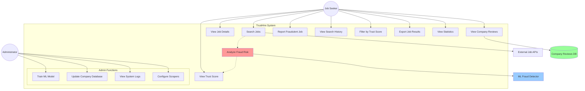

# Use Case Diagram - TrustHire Job Fraud Detection System

## Actors

### Primary Actors
- **Job Seeker**: End user searching for jobs and checking fraud risk
- **Administrator**: System admin managing ML models and configurations

### Secondary Actors
- **External Job APIs**: RemoteOK, Remotive job platforms
- **ML Fraud Detector**: Machine learning fraud detection system
- **Company Reviews DB**: Database storing company reviews and ratings

## Use Cases

### Job Seeker Use Cases

1. **Search Jobs (UC1)**
   - Description: Search for jobs using keywords, location, and experience level
   - Preconditions: None
   - Postconditions: List of jobs with trust scores displayed

2. **View Job Details (UC2)**
   - Description: View detailed information about a specific job
   - Preconditions: Job must be in search results
   - Postconditions: Complete job details displayed with fraud analysis

3. **Analyze Fraud Risk (UC3)**
   - Description: System automatically analyzes fraud risk using ML
   - Preconditions: Job data available
   - Postconditions: Trust score and fraud indicators generated
   - Includes: UC4 (View Trust Score)

4. **View Trust Score (UC4)**
   - Description: View trust score percentage and verdict
   - Preconditions: Fraud analysis completed
   - Postconditions: Trust score and color-coded indicator shown

5. **View Company Reviews (UC5)**
   - Description: View employee reviews and company ratings
   - Preconditions: Company exists in database
   - Postconditions: Reviews, ratings, and sentiment displayed

6. **Report Fraudulent Job (UC6)**
   - Description: Report a job as fraudulent with reason
   - Preconditions: Job must exist
   - Postconditions: Report saved to database

7. **View Search History (UC7)**
   - Description: View previous job searches
   - Preconditions: User has performed searches
   - Postconditions: Search history displayed

8. **Filter by Trust Score (UC8)**
   - Description: Filter jobs by trust score threshold
   - Preconditions: Search results available
   - Postconditions: Filtered job list displayed

9. **Export Job Results (UC9)**
   - Description: Export search results to file
   - Preconditions: Search results available
   - Postconditions: Jobs exported in requested format

10. **View Statistics (UC10)**
    - Description: View fraud detection statistics
    - Preconditions: Jobs have been analyzed
    - Postconditions: Statistics dashboard displayed

### Administrator Use Cases

11. **Train ML Model (UC11)**
    - Description: Train/retrain fraud detection ML model
    - Preconditions: Training data available
    - Postconditions: Updated model deployed

12. **Update Company Database (UC12)**
    - Description: Add/update company reviews and ratings
    - Preconditions: Valid company data
    - Postconditions: Database updated

13. **View System Logs (UC13)**
    - Description: View system logs and errors
    - Preconditions: Admin privileges
    - Postconditions: Logs displayed

14. **Configure Scrapers (UC14)**
    - Description: Configure job scraper settings
    - Preconditions: Admin privileges
    - Postconditions: Scraper configuration updated

## Relationships

- **Include**: UC3 (Analyze Fraud Risk) includes UC4 (View Trust Score)
- **Extend**: UC1 (Search Jobs) extends to UC3 (Analyze Fraud Risk)
- **Association**: All use cases associated with respective actors
