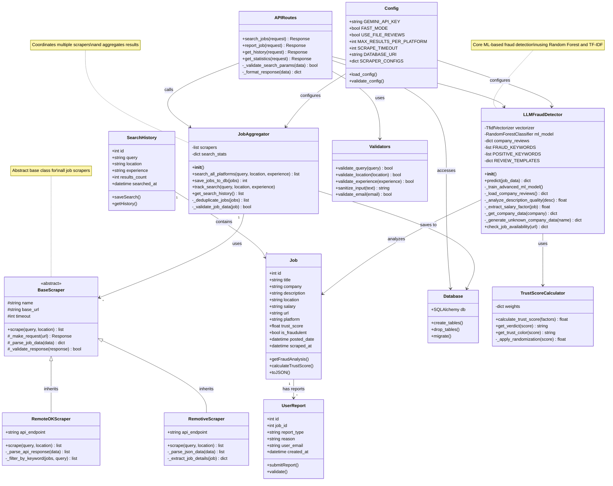

# Class Diagram - TrustHire Job Fraud Detection System

## Class Descriptions

### Entity Classes

**Job**
- Represents a job posting from external platforms
- Stores all job details including trust score and fraud analysis
- Primary entity in the system

**UserReport**
- Stores user-submitted fraud reports
- Linked to specific jobs
- Helps improve fraud detection

**SearchHistory**
- Tracks user search queries
- Used for analytics and improving search

### Business Logic Classes

**LLMFraudDetector**
- Core fraud detection engine using ML
- Uses Random Forest classifier with TF-IDF vectorization
- Analyzes description, salary, company, and reviews
- Returns trust score (0.0-1.0) and detailed analysis

**JobAggregator**
- Coordinates multiple job scrapers
- Aggregates and deduplicates results
- Manages search history and statistics

**TrustScoreCalculator**
- Calculates weighted trust scores
- Applies randomization for variety
- Generates verdicts and color codes

### Scraper Classes

**BaseScraper (Abstract)**
- Base class for all job scrapers
- Defines common interface
- Handles HTTP requests and validation

**RemoteOKScraper**
- Scrapes RemoteOK API
- Filters jobs by keyword

**RemotiveScraper**
- Scrapes Remotive API
- Extracts structured job data

### Utility Classes

**Config**
- Centralized configuration management
- Stores API keys, timeouts, database URIs

**APIRoutes**
- Flask REST API endpoints
- Handles HTTP requests/responses

**Validators**
- Input validation and sanitization
- Security checks

**Database**
- SQLAlchemy database interface
- Schema management

## Key Design Patterns

1. **Singleton**: LLMFraudDetector (via get_fraud_detector)
2. **Strategy**: BaseScraper with multiple implementations
3. **Facade**: JobAggregator simplifies scraper coordination
4. **Factory**: Scraper instantiation
5. **Repository**: Database access layer
