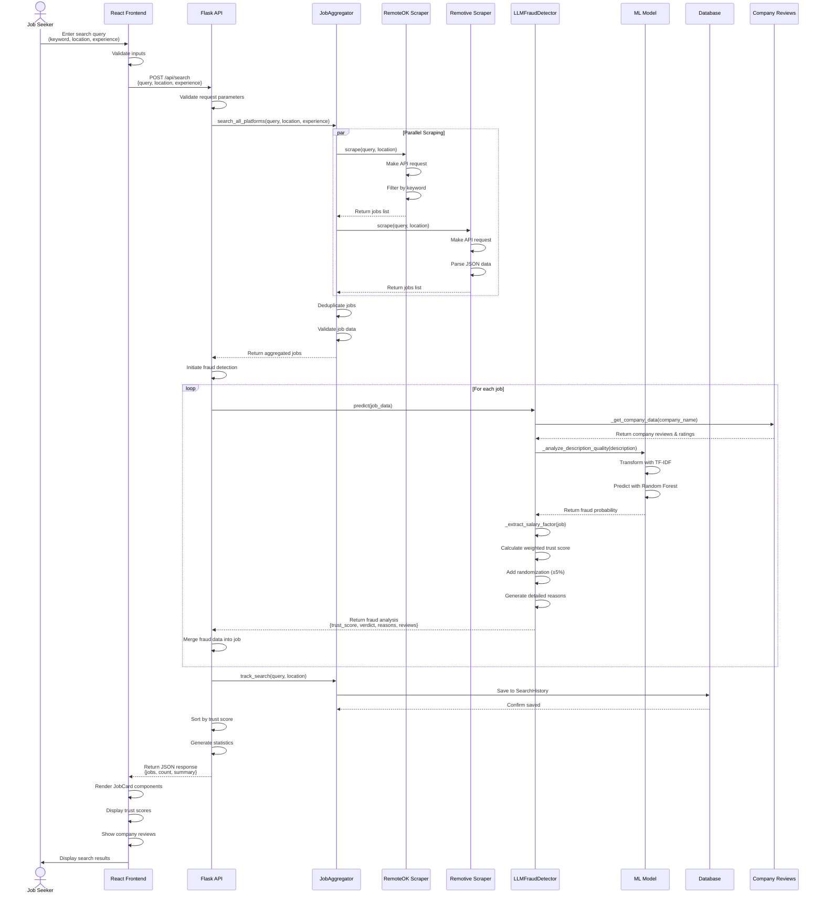
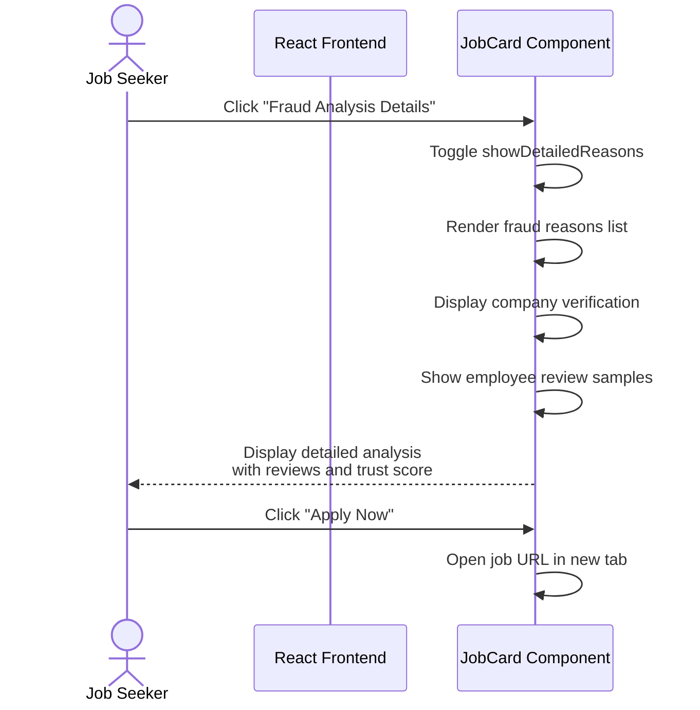
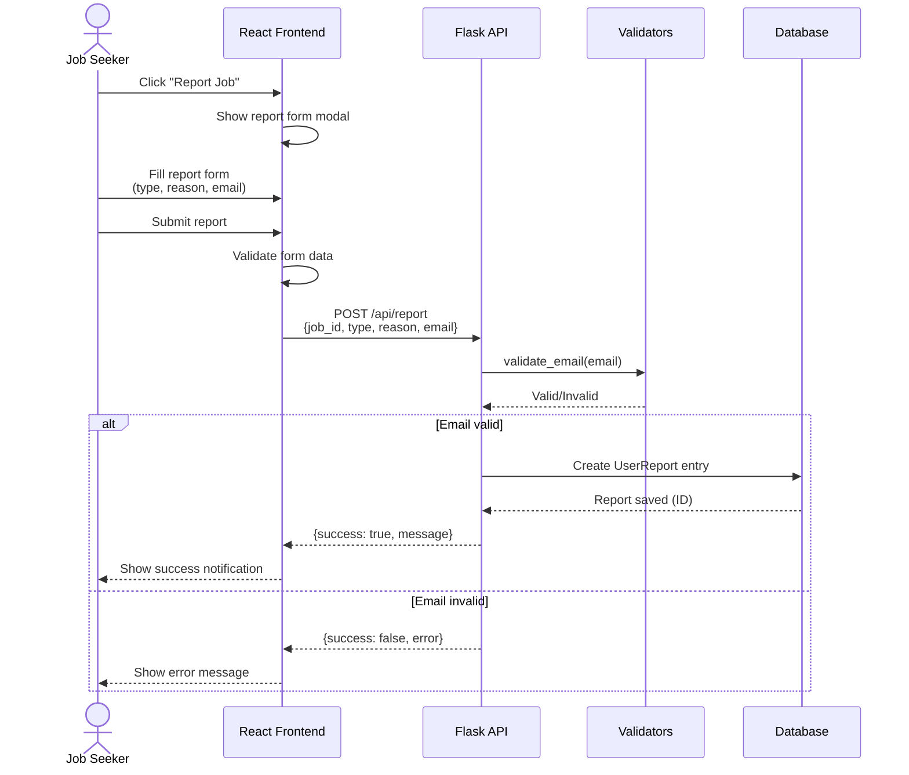
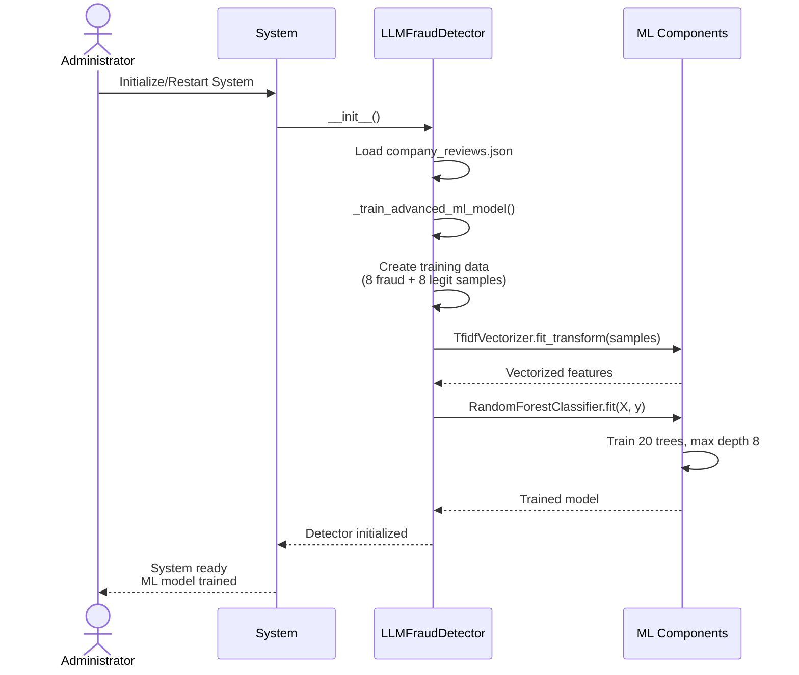

# Sequence Diagram - TrustHire Job Search and Fraud Detection

## 1. Main Job Search Flow

## 2. View Job Details Flow

## 3. Report Fraudulent Job Flow

## 4. ML Model Training Flow (Admin)

## Timing Considerations

- **Job Search**: 2-8 seconds (depending on scrapers)
- **Fraud Analysis per Job**: <100ms (file-based, no web scraping)
- **Total Analysis for 10 jobs**: ~1 second
- **ML Model Training**: ~2 seconds (on startup)
- **Database Operations**: <50ms

## Error Handling

1. **Scraper Failure**: Continue with other scrapers
2. **Fraud Detection Error**: Return default trust score (0.5)
3. **Database Error**: Log error, continue operation
4. **API Timeout**: Return partial results
5. **Validation Error**: Return 400 Bad Request
