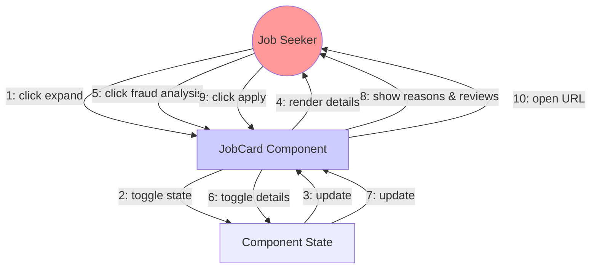
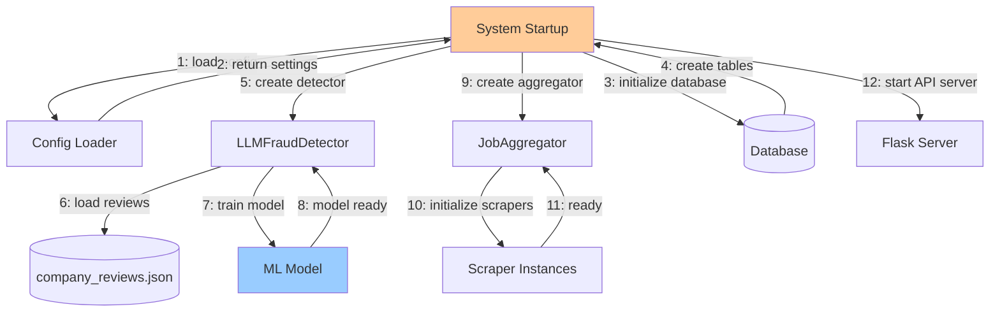

# Collaboration Diagram - TrustHire Job Fraud Detection System

## 1. Job Search Collaboration

```mermaid
graph TB
    User((Job Seeker))
    Frontend[React Frontend<br/>SearchBar Component]
    API[Flask API<br/>APIRoutes]
    JobAgg[JobAggregator]
    Scraper1[RemoteOK Scraper]
    Scraper2[Remotive Scraper]
    FraudDet[LLMFraudDetector]
    DB[(Database)]
    
    User -->|1: enter search query| Frontend
    Frontend -->|2: POST /api/search| API
    API -->|3: search_all_platforms()| JobAgg
    JobAgg -->|4a: scrape()| Scraper1
    JobAgg -->|4b: scrape()| Scraper2
    Scraper1 -->|5a: return jobs| JobAgg
    Scraper2 -->|5b: return jobs| JobAgg
    JobAgg -->|6: aggregated jobs| API
    API -->|7: predict() for each job| FraudDet
    FraudDet -->|8: fraud analysis| API
    API -->|9: track_search()| JobAgg
    JobAgg -->|10: save| DB
    API -->|11: JSON response| Frontend
    Frontend -->|12: display results| User
    
    style User fill:#ff9999
    style FraudDet fill:#99ccff
    style DB fill:#99ff99
```

**Message Flow:**
1. User → Frontend: Enter search parameters
2. Frontend → API: POST /api/search {query, location, experience}
3. API → JobAggregator: search_all_platforms()
4. JobAggregator → Scrapers: scrape() [parallel]
5. Scrapers → JobAggregator: return job lists
6. JobAggregator → API: return deduplicated jobs
7. API → FraudDetector: predict(job_data) [loop]
8. FraudDetector → API: fraud analysis results
9. API → JobAggregator: track_search()
10. JobAggregator → Database: save search history
11. API → Frontend: JSON response with jobs and scores
12. Frontend → User: display search results

## 2. Fraud Detection Collaboration

```mermaid
graph TB
    API[Flask API]
    FraudDet[LLMFraudDetector]
    MLModel[Random Forest<br/>Classifier]
    Vectorizer[TF-IDF<br/>Vectorizer]
    ReviewDB[(Company Reviews<br/>JSON File)]
    Calculator[TrustScore<br/>Calculator]
    
    API -->|1: predict(job_data)| FraudDet
    FraudDet -->|2: load company data| ReviewDB
    ReviewDB -->|3: company reviews| FraudDet
    FraudDet -->|4: transform text| Vectorizer
    Vectorizer -->|5: feature vector| MLModel
    MLModel -->|6: fraud probability| FraudDet
    FraudDet -->|7: calculate factors| Calculator
    Calculator -->|8: weighted score| FraudDet
    FraudDet -->|9: add randomization| Calculator
    Calculator -->|10: final score| FraudDet
    FraudDet -->|11: complete analysis| API
    
    style FraudDet fill:#99ccff
    style MLModel fill:#ffcc99
    style ReviewDB fill:#99ff99
```

**Message Flow:**
1. API → FraudDetector: predict(job_data)
2. FraudDetector → ReviewDB: _get_company_data(company_name)
3. ReviewDB → FraudDetector: {rating, reviews, samples}
4. FraudDetector → Vectorizer: transform(description)
5. Vectorizer → MLModel: feature_vector
6. MLModel → FraudDetector: fraud_probability
7. FraudDetector → Calculator: calculate_trust_score(factors)
8. Calculator → FraudDetector: weighted_score
9. FraudDetector → Calculator: apply_randomization(score)
10. Calculator → FraudDetector: final_trust_score
11. FraudDetector → API: {trust_score, verdict, reasons, reviews}

## 3. View Job Details Collaboration



**Message Flow:**
1. User → JobCard: Click "Read More"
2. JobCard → State: setExpanded(!expanded)
3. State → JobCard: State updated
4. JobCard → User: Render full description
5. User → JobCard: Click "Fraud Analysis Details"
6. JobCard → State: setShowDetailedReasons(!show)
7. State → JobCard: State updated
8. JobCard → User: Display fraud reasons & employee reviews
9. User → JobCard: Click "Apply Now"
10. JobCard → User: Open job URL in new tab

## 4. Report Submission Collaboration

```mermaid
graph TB
    User((Job Seeker))
    JobCard[JobCard Component]
    API[Flask API]
    Validators[Validators]
    DB[(Database)]
    
    User -->|1: click report| JobCard
    JobCard -->|2: show form| User
    User -->|3: submit report| JobCard
    JobCard -->|4: POST /api/report| API
    API -->|5: validate_email()| Validators
    Validators -->|6: valid/invalid| API
    API -->|7: create report| DB
    DB -->|8: confirm saved| API
    API -->|9: success response| JobCard
    JobCard -->|10: show notification| User
    
    style User fill:#ff9999
    style DB fill:#99ff99
```

**Message Flow:**
1. User → JobCard: Click "Report Job"
2. JobCard → User: Display report form modal
3. User → JobCard: Submit {type, reason, email}
4. JobCard → API: POST /api/report
5. API → Validators: validate_email(email)
6. Validators → API: true/false
7. API → Database: Create UserReport entry
8. Database → API: Report ID
9. API → JobCard: {success: true}
10. JobCard → User: "Report submitted successfully"

## 5. System Initialization Collaboration



**Message Flow:**
1. System → Config: load_config()
2. Config → System: configuration settings
3. System → Database: create_tables()
4. Database → System: tables created
5. System → FraudDetector: __init__()
6. FraudDetector → JSON: _load_company_reviews()
7. FraudDetector → MLModel: _train_advanced_ml_model()
8. MLModel → FraudDetector: trained model
9. System → JobAggregator: __init__()
10. JobAggregator → Scrapers: instantiate scrapers
11. Scrapers → JobAggregator: scrapers ready
12. System → Flask: Start API server on port 5000

## Object Responsibilities

### Frontend Objects
- **SearchBar**: Capture user input, trigger search
- **JobCard**: Display job details, handle user interactions
- **JobList**: Manage collection of JobCards

### Backend Objects
- **APIRoutes**: Handle HTTP requests, coordinate services
- **JobAggregator**: Coordinate scrapers, aggregate results
- **LLMFraudDetector**: Perform ML-based fraud analysis
- **Scrapers**: Fetch jobs from external APIs
- **Database**: Persist data

### Data Objects
- **Job**: Store job information
- **UserReport**: Store fraud reports
- **SearchHistory**: Track search queries
