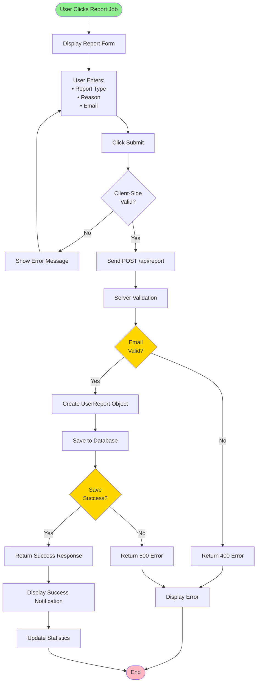

# Activity Diagram - TrustHire Job Fraud Detection System

## 1. Complete Job Search Process

```mermaid
flowchart TD
    Start([User Opens Application]) --> InputSearch[Enter Search Query<br/>keyword, location, experience]
    InputSearch --> ValidateInput{Input<br/>Valid?}
    
    ValidateInput -->|No| ShowError[Display Validation Error]
    ShowError --> InputSearch
    
    ValidateInput -->|Yes| InitSearch[Initialize Search Request]
    InitSearch --> SendAPI[Send POST /api/search]
    
    SendAPI --> ParallelScrape[Start Parallel Scraping]
    
    ParallelScrape --> Scraper1[RemoteOK Scraper]
    ParallelScrape --> Scraper2[Remotive Scraper]
    
    Scraper1 --> FetchAPI1[Fetch RemoteOK API]
    Scraper2 --> FetchAPI2[Fetch Remotive API]
    
    FetchAPI1 --> Filter1[Filter by Keyword]
    FetchAPI2 --> Parse2[Parse JSON Data]
    
    Filter1 --> JobList1[Job List 1]
    Parse2 --> JobList2[Job List 2]
    
    JobList1 --> Aggregate[Aggregate All Jobs]
    JobList2 --> Aggregate
    
    Aggregate --> Deduplicate[Remove Duplicates]
    Deduplicate --> ValidateJobs[Validate Job Data]
    
    ValidateJobs --> CheckJobs{Jobs<br/>Found?}
    
    CheckJobs -->|No| NoResults[Display No Results]
    NoResults --> End([End])
    
    CheckJobs -->|Yes| StartAnalysis[Start Fraud Detection Loop]
    
    StartAnalysis --> NextJob[Get Next Job]
    NextJob --> LoadCompany[Load Company Data<br/>from Database]
    
    LoadCompany --> CheckCompany{Company<br/>Found?}
    
    CheckCompany -->|Yes| GetReviews[Get Company Reviews<br/>& Rating]
    CheckCompany -->|No| GenCompany[Generate Unknown<br/>Company Data]
    
    GetReviews --> AnalyzeDesc[Analyze Description<br/>with ML Model]
    GenCompany --> AnalyzeDesc
    
    AnalyzeDesc --> TransformText[Transform Text<br/>with TF-IDF]
    TransformText --> PredictML[Predict with<br/>Random Forest]
    
    PredictML --> ExtractSalary[Extract Salary<br/>Patterns]
    ExtractSalary --> CheckSalary{Suspicious<br/>Salary?}
    
    CheckSalary -->|Yes| LowSalaryScore[Low Salary Score]
    CheckSalary -->|No| HighSalaryScore[High Salary Score]
    
    LowSalaryScore --> CalcWeighted[Calculate Weighted<br/>Trust Score]
    HighSalaryScore --> CalcWeighted
    
    CalcWeighted --> AddRandom[Add ±5%<br/>Randomization]
    AddRandom --> GenReasons[Generate Detailed<br/>Fraud Reasons]
    
    GenReasons --> GenVerdict[Generate Final<br/>Verdict]
    GenVerdict --> MergeData[Merge Fraud Data<br/>into Job]
    
    MergeData --> MoreJobs{More<br/>Jobs?}
    
    MoreJobs -->|Yes| NextJob
    MoreJobs -->|No| SortJobs[Sort by Trust Score]
    
    SortJobs --> CalcStats[Calculate Statistics]
    CalcStats --> SaveHistory[Save Search History]
    SaveHistory --> SendResponse[Send JSON Response]
    
    SendResponse --> RenderJobs[Render Job Cards]
    RenderJobs --> DisplayResults[Display Search Results<br/>with Trust Scores]
    
    DisplayResults --> UserAction{User<br/>Action?}
    
    UserAction -->|View Details| ShowDetails[Show Fraud Analysis<br/>& Employee Reviews]
    UserAction -->|Apply| OpenURL[Open Job URL]
    UserAction -->|Report| ReportJob[Submit Fraud Report]
    UserAction -->|New Search| InputSearch
    UserAction -->|Exit| End
    
    ShowDetails --> UserAction
    OpenURL --> UserAction
    ReportJob --> SaveReport[Save to Database]
    SaveReport --> UserAction
    
    style Start fill:#90EE90
    style End fill:#FFB6C1
    style CheckJobs fill:#FFD700
    style CheckCompany fill:#FFD700
    style CheckSalary fill:#FFD700
    style MoreJobs fill:#FFD700
    style UserAction fill:#FFD700
    style PredictML fill:#87CEEB
    style CalcWeighted fill:#87CEEB
```

## 2. Fraud Detection Process (Detailed)

```mermaid
flowchart TD
    Start([Start Fraud Detection]) --> ReceiveJob[Receive Job Data]
    ReceiveJob --> ExtractFields[Extract Job Fields<br/>title, company, description, salary]
    
    ExtractFields --> CompanyLookup[Search Company in Database]
    CompanyLookup --> CompanyExists{Company<br/>Exists?}
    
    CompanyExists -->|Yes| LoadReviews[Load Company Reviews,<br/>Rating, Sentiment]
    CompanyExists -->|No| CheckSuspicious{Generic/<br/>Suspicious<br/>Name?}
    
    CheckSuspicious -->|Yes| FakeCompany[Mark as Suspicious<br/>confidence: 0.2]
    CheckSuspicious -->|No| GenRating[Generate Hash-Based<br/>Rating 2.8-4.0]
    
    LoadReviews --> PickReviews[Pick 3 Random<br/>Review Samples]
    FakeCompany --> SetFactors[Set Base Factors]
    GenRating --> PickMixed[Pick Mixed<br/>Review Samples]
    
    PickReviews --> SetFactors
    PickMixed --> SetFactors
    
    SetFactors --> MLAnalysis[ML Description Analysis]
    MLAnalysis --> CountKeywords[Count Fraud Keywords]
    CountKeywords --> CountPositive[Count Positive Keywords]
    
    CountPositive --> CheckFraud{Fraud<br/>Keywords<br/>>2?}
    
    CheckFraud -->|Yes| LowDescScore[Description Score: 0.2]
    CheckFraud -->|No| CheckPositive{Positive<br/>Keywords<br/>>3?}
    
    CheckPositive -->|Yes| HighDescScore[Description Score: 0.9]
    CheckPositive -->|No| MedDescScore[Description Score: 0.7]
    
    LowDescScore --> SalaryCheck[Salary Pattern Check]
    HighDescScore --> SalaryCheck
    MedDescScore --> SalaryCheck
    
    SalaryCheck --> DailyWeekly{Daily/<br/>Weekly<br/>Pay?}
    
    DailyWeekly -->|Yes| SuspSalary[Salary Score: 0.2]
    DailyWeekly -->|No| AnnualCheck{Annual/<br/>Range?}
    
    AnnualCheck -->|Yes| GoodSalary[Salary Score: 0.9]
    AnnualCheck -->|No| NeutralSalary[Salary Score: 0.6]
    
    SuspSalary --> CalcTrust[Calculate Weighted Trust<br/>Company: 35%<br/>Description: 40%<br/>Salary: 15%<br/>Reviews: 10%]
    GoodSalary --> CalcTrust
    NeutralSalary --> CalcTrust
    
    CalcTrust --> ApplyRandom[Apply Random ±5%]
    ApplyRandom --> ClampScore[Clamp to 0.15-0.95]
    
    ClampScore --> CheckThreshold{Trust<br/>Score<br/><0.5?}
    
    CheckThreshold -->|Yes| MarkFraud[is_fraudulent: true]
    CheckThreshold -->|No| MarkSafe[is_fraudulent: false]
    
    MarkFraud --> GenReasons[Generate Detailed Reasons]
    MarkSafe --> GenReasons
    
    GenReasons --> AddCompanyInfo[Add Company<br/>Verification Info]
    AddCompanyInfo --> AddReviewSamples[Add Review Samples]
    AddReviewSamples --> GenVerdict{Score<br/>Range?}
    
    GenVerdict -->|>=0.75| VerdictHigh[HIGHLY TRUSTWORTHY]
    GenVerdict -->|>=0.60| VerdictGood[LIKELY SAFE]
    GenVerdict -->|>=0.45| VerdictMod[MODERATE RISK]
    GenVerdict -->|>=0.30| VerdictHigh2[HIGH RISK]
    GenVerdict -->|<0.30| VerdictExtreme[EXTREME RISK]
    
    VerdictHigh --> BuildResult[Build Result Object]
    VerdictGood --> BuildResult
    VerdictMod --> BuildResult
    VerdictHigh2 --> BuildResult
    VerdictExtreme --> BuildResult
    
    BuildResult --> LogAnalysis[Log Analysis]
    LogAnalysis --> Return([Return Fraud Analysis])
    
    style Start fill:#90EE90
    style Return fill:#FFB6C1
    style MLAnalysis fill:#87CEEB
    style CalcTrust fill:#87CEEB
```

## 3. Report Submission Process

## 4. System Initialization Process

```mermaid
flowchart TD
    Start([Application Start]) --> LoadConfig[Load Configuration<br/>from config.py]
    LoadConfig --> CheckEnv{Environment<br/>Variables<br/>Set?}
    
    CheckEnv -->|No| UseDefaults[Use Default Values]
    CheckEnv -->|Yes| LoadEnv[Load from Environment]
    
    UseDefaults --> InitDB[Initialize Database]
    LoadEnv --> InitDB
    
    InitDB --> CreateTables[Create Tables if<br/>Not Exists]
    CreateTables --> InitDetector[Initialize<br/>LLMFraudDetector]
    
    InitDetector --> LoadReviewsFile[Load company_reviews.json]
    LoadReviewsFile --> FileExists{File<br/>Exists?}
    
    FileExists -->|No| EmptyDB[Use Empty Database]
    FileExists -->|Yes| ParseJSON[Parse JSON Data]
    
    ParseJSON --> StoreReviews[Store in Memory]
    EmptyDB --> TrainML[Train ML Model]
    StoreReviews --> TrainML
    
    TrainML --> CreateSamples[Create Training Samples<br/>8 Fraud + 8 Legit]
    CreateSamples --> FitVectorizer[Fit TF-IDF Vectorizer]
    FitVectorizer --> FitRF[Fit Random Forest<br/>20 trees, depth 8]
    
    FitRF --> InitAggregator[Initialize JobAggregator]
    InitAggregator --> InitScrapers[Initialize Scrapers]
    
    InitScrapers --> CreateScraper1[Create RemoteOK Scraper]
    InitScrapers --> CreateScraper2[Create Remotive Scraper]
    
    CreateScraper1 --> RegScrapers[Register Scrapers]
    CreateScraper2 --> RegScrapers
    
    RegScrapers --> StartFlask[Start Flask Server]
    StartFlask --> BindPort[Bind to Port 5000]
    BindPort --> EnableDebug{Debug<br/>Mode?}
    
    EnableDebug -->|Yes| EnableReloader[Enable Auto-Reloader]
    EnableDebug -->|No| StartServer[Start Server]
    
    EnableReloader --> StartServer
    StartServer --> LogReady[Log: System Ready]
    LogReady --> Ready([Application Ready])
    
    style Start fill:#90EE90
    style Ready fill:#90EE90
    style TrainML fill:#87CEEB
```

## Activity Descriptions

### Main Activities
1. **Search Jobs**: User initiates search, system scrapes and analyzes
2. **Detect Fraud**: ML-based multi-factor fraud analysis
3. **Display Results**: Render jobs with trust scores and reviews
4. **Report Job**: User reports suspicious job
5. **Initialize System**: Startup sequence with ML training

### Decision Points
- Input validation
- Company existence check
- Fraud keyword detection
- Trust score threshold
- Email validation

### Parallel Activities
- Multiple scrapers run simultaneously
- Each job analyzed independently
- Reviews loaded while ML processes

### Error Handling
- Invalid input → Show error, retry
- No jobs found → Display message
- Scraper failure → Continue with others
- Database error → Log and continue
