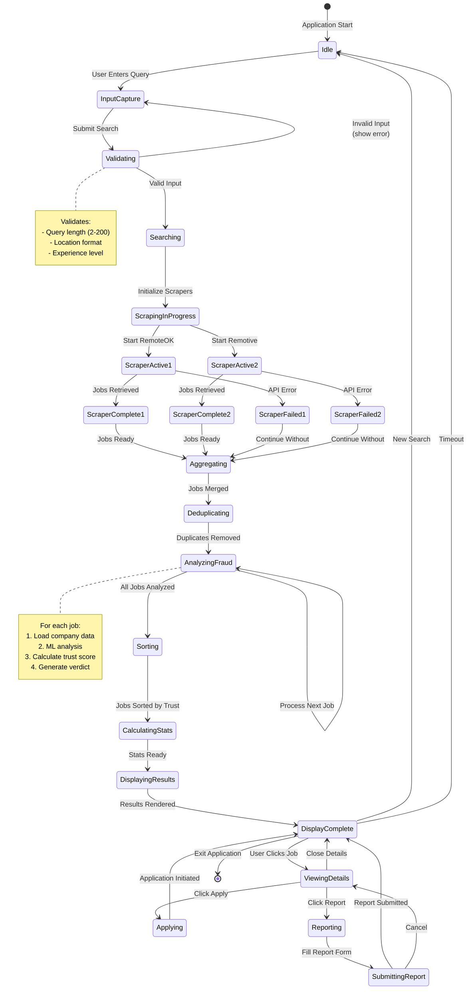
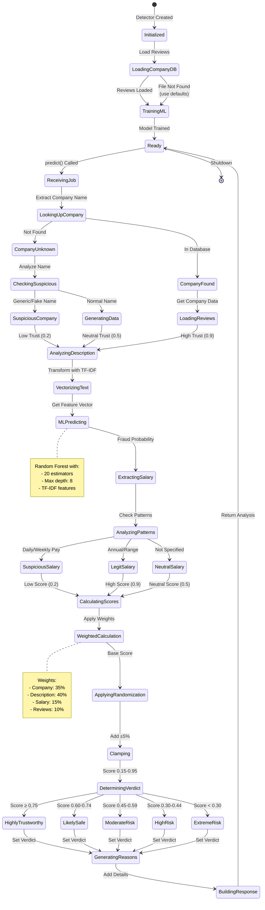
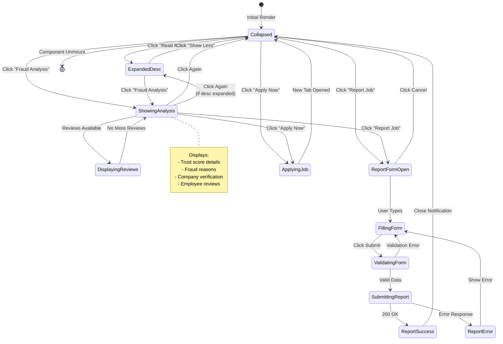
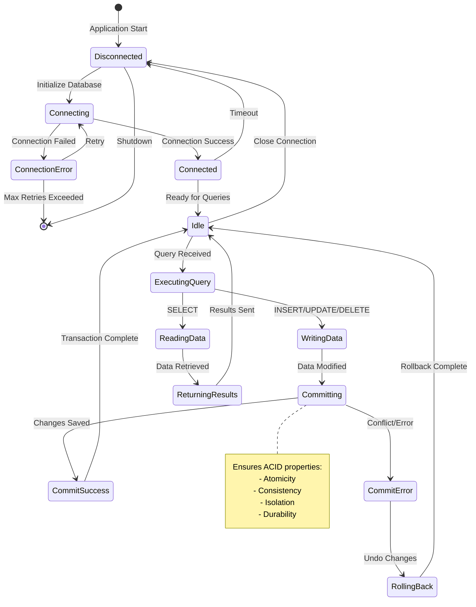
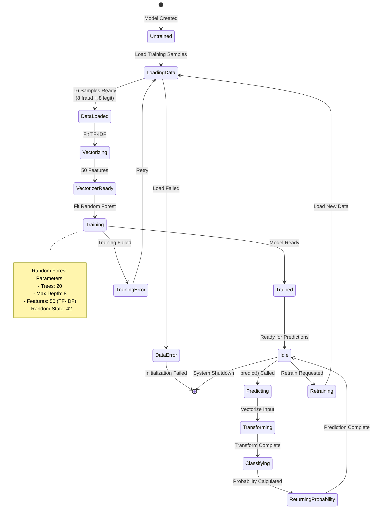

# State Chart Diagram - TrustHire Job Fraud Detection System

## 1. Job Search State Machine

## 2. Fraud Detection State Machine

## 3. Job Card Component State Machine

## 4. Database Connection State Machine

## 5. ML Model State Machine

## State Descriptions

### Job Search States
- **Idle**: Waiting for user input
- **Searching**: Active scraping in progress
- **AnalyzingFraud**: ML processing each job
- **DisplayingResults**: Showing jobs with trust scores

### Fraud Detection States
- **Ready**: Detector initialized and waiting
- **AnalyzingDescription**: ML text analysis
- **CalculatingScores**: Weighted scoring
- **GeneratingReasons**: Building detailed analysis

### Job Card States
- **Collapsed**: Minimal view
- **ShowingAnalysis**: Fraud details visible
- **ReportFormOpen**: Report modal active

### Transitions
- User actions trigger state changes
- Automatic transitions after processing
- Error states with retry capability
- Timeout transitions to idle states

### Guard Conditions
- Input validation gates
- Trust score thresholds
- Data availability checks
- Error state conditions
