# Component Diagram - TrustHire Job Fraud Detection System

```mermaid
graph TB
    subgraph "Frontend Layer - React Application"
        UI[Web Browser UI]
        
        subgraph "React Components"
            App[App Component]
            SearchBar[SearchBar Component]
            JobList[JobList Component]
            JobCard[JobCard Component]
            Stats[Statistics Component]
            Header[Header Component]
        end
        
        subgraph "Frontend Services"
            APIService[API Service<br/>api.js]
            StateManager[State Management]
        end
        
        subgraph "Frontend Assets"
            CSS[Stylesheets<br/>.css files]
            Images[Images/Icons]
        end
    end
    
    subgraph "Backend Layer - Flask API"
        FlaskServer[Flask Web Server<br/>Port 5000]
        
        subgraph "API Layer"
            Routes[API Routes<br/>routes.py]
            Validators[Validators<br/>validators.py]
        end
        
        subgraph "Business Logic Layer"
            JobAgg[Job Aggregator<br/>job_model.py]
            FraudDet[Fraud Detector<br/>fraud_detector.py]
            TextProc[Text Processor<br/>text_processor.py]
        end
        
        subgraph "Scraper Components"
            BaseScraper[Base Scraper<br/>base_scraper.py]
            RemoteOK[RemoteOK Scraper<br/>remoteok_scraper.py]
            Remotive[Remotive Scraper<br/>remotive_scraper.py]
        end
        
        subgraph "ML Components"
            MLModel[Random Forest<br/>Classifier]
            Vectorizer[TF-IDF<br/>Vectorizer]
            Trainer[Model Trainer]
        end
        
        subgraph "Configuration"
            Config[Configuration<br/>config.py]
            Env[Environment<br/>Variables]
        end
    end
    
    subgraph "Data Layer"
        subgraph "Database"
            DB[(SQLite Database<br/>trusthire.db)]
            JobTable[Job Table]
            ReportTable[UserReport Table]
            HistoryTable[SearchHistory Table]
        end
        
        subgraph "File Storage"
            ReviewsDB[Company Reviews<br/>company_reviews.json]
            Logs[Application Logs<br/>app.log]
        end
    end
    
    subgraph "External Services"
        RemoteOKAPI[RemoteOK API<br/>remoteok.com/api]
        RemotiveAPI[Remotive API<br/>remotive.com/api]
    end
    
    %% Frontend Internal Connections
    UI --> App
    App --> SearchBar
    App --> JobList
    App --> Stats
    App --> Header
    JobList --> JobCard
    
    SearchBar --> APIService
    JobCard --> APIService
    APIService --> StateManager
    
    CSS --> App
    Images --> Header
    
    %% Frontend to Backend
    APIService -->|HTTP POST/GET| Routes
    
    %% API Layer Connections
    Routes --> Validators
    Routes --> JobAgg
    Routes --> FraudDet
    Routes --> DB
    
    %% Business Logic Connections
    JobAgg --> BaseScraper
    BaseScraper --> RemoteOK
    BaseScraper --> Remotive
    
    FraudDet --> MLModel
    FraudDet --> Vectorizer
    FraudDet --> TextProc
    FraudDet --> ReviewsDB
    
    Trainer --> MLModel
    Trainer --> Vectorizer
    
    %% Configuration Connections
    Config --> FlaskServer
    Config --> JobAgg
    Config --> FraudDet
    Env --> Config
    
    %% Database Connections
    JobAgg --> JobTable
    Routes --> ReportTable
    JobAgg --> HistoryTable
    
    JobTable --> DB
    ReportTable --> DB
    HistoryTable --> DB
    
    Routes --> Logs
    FraudDet --> Logs
    
    %% External API Connections
    RemoteOK -->|HTTPS GET| RemoteOKAPI
    Remotive -->|HTTPS GET| RemotiveAPI
    
    %% Styling
    style UI fill:#e1f5ff
    style FlaskServer fill:#fff3e0
    style DB fill:#e8f5e9
    style MLModel fill:#f3e5f5
    style RemoteOKAPI fill:#fce4ec
    style RemotiveAPI fill:#fce4ec
    
    classDef frontend fill:#bbdefb
    classDef backend fill:#ffe0b2
    classDef data fill:#c8e6c9
    classDef ml fill:#e1bee7
    
    class App,SearchBar,JobList,JobCard,Stats,Header,APIService,StateManager frontend
    class Routes,Validators,JobAgg,FraudDet,TextProc,BaseScraper,RemoteOK,Remotive backend
    class JobTable,ReportTable,HistoryTable,ReviewsDB,Logs data
    class MLModel,Vectorizer,Trainer ml
```



## Component Details

### Frontend Components

#### **Web Browser UI**
- **Description**: User interface rendered in browser
- **Technology**: HTML5, CSS3, JavaScript (React)
- **Port**: 3000 (development)
- **Interfaces**: 
  - Provides: User interaction interface
  - Requires: HTTP API

#### **React Components**
1. **App Component** (`App.js`)
   - Root component
   - Manages global state
   - Routes coordination

2. **SearchBar Component** (`SearchBar.js`)
   - Query input form
   - Validation feedback
   - Search submission

3. **JobList Component** (`JobList.js`)
   - Displays job collection
   - Sorting and filtering
   - Empty state handling

4. **JobCard Component** (`JobCard.js`)
   - Individual job display
   - Trust score visualization
   - Fraud analysis modal
   - Employee reviews display

5. **Statistics Component** (`Statistics.js`)
   - Fraud detection stats
   - Data visualization
   - Summary metrics

6. **Header Component** (`Header.js`)
   - App branding
   - Navigation

#### **API Service** (`api.js`)
- **Purpose**: HTTP communication layer
- **Functions**:
  - `searchJobs(query, location, experience)`
  - `reportJob(jobId, reportData)`
  - `getSearchHistory()`
- **Technology**: Axios/Fetch API

### Backend Components

#### **Flask Web Server**
- **Framework**: Flask 3.0.0
- **Port**: 5000
- **Features**:
  - RESTful API
  - CORS enabled
  - JSON responses
  - Error handling

#### **API Layer**

1. **API Routes** (`routes.py`)
   - **Endpoints**:
     - `POST /api/search` - Search jobs
     - `POST /api/report` - Report fraud
     - `GET /api/history` - Search history
     - `GET /api/statistics` - Stats
   - **Responsibilities**:
     - Request parsing
     - Response formatting
     - Error handling

2. **Validators** (`validators.py`)
   - Input sanitization
   - Format validation
   - Security checks

#### **Business Logic Layer**

1. **Job Aggregator** (`job_model.py`)
   - **Responsibilities**:
     - Coordinate scrapers
     - Aggregate results
     - Deduplicate jobs
     - Track searches
   - **Dependencies**: Scrapers, Database

2. **Fraud Detector** (`fraud_detector.py`)
   - **Responsibilities**:
     - ML-based fraud detection
     - Trust score calculation
     - Company verification
     - Review analysis
   - **Dependencies**: ML Model, TF-IDF, Reviews DB
   - **Key Methods**:
     - `predict(job_data)` → fraud analysis
     - `_analyze_description_quality()` → ML text analysis
     - `_extract_salary_factor()` → salary validation
     - `_get_company_data()` → review lookup

3. **Text Processor** (`text_processor.py`)
   - Text cleaning
   - HTML removal
   - Tokenization

#### **Scraper Components**

1. **Base Scraper** (`base_scraper.py`)
   - Abstract base class
   - Common HTTP methods
   - Error handling
   - Rate limiting

2. **RemoteOK Scraper** (`remoteok_scraper.py`)
   - API: `https://remoteok.com/api`
   - JSON parsing
   - Keyword filtering

3. **Remotive Scraper** (`remotive_scraper.py`)
   - API: `https://remotive.com/api/remote-jobs`
   - Structured data extraction
   - Job detail parsing

#### **ML Components**

1. **Random Forest Classifier**
   - **Library**: scikit-learn 1.8.0
   - **Parameters**:
     - Estimators: 20
     - Max depth: 8
     - Random state: 42
   - **Input**: TF-IDF feature vector
   - **Output**: Fraud probability

2. **TF-IDF Vectorizer**
   - **Features**: 50
   - **N-grams**: (1, 2)
   - **Stop words**: English
   - **Purpose**: Text → numerical features

3. **Model Trainer**
   - Training data: 16 samples
   - One-time training on startup
   - Retraining capability

#### **Configuration**

1. **Config** (`config.py`)
   - Database URI
   - API keys
   - Timeouts
   - Feature flags:
     - `FAST_MODE = True`
     - `USE_FILE_REVIEWS = True`

2. **Environment Variables**
   - Development/production settings
   - Sensitive credentials

### Data Layer Components

#### **SQLite Database** (`trusthire.db`)
- **Tables**:
  1. **Job Table**
     - Schema: id, title, company, description, salary, etc.
     - Indexes: company, platform, posted_date
  
  2. **UserReport Table**
     - Schema: id, job_id, report_type, reason, email, created_at
     - Foreign key: job_id → Job.id
  
  3. **SearchHistory Table**
     - Schema: id, query, location, experience, results_count, searched_at
     - Indexes: searched_at

#### **File Storage**

1. **Company Reviews** (`company_reviews.json`)
   - Structure:
     ```json
     {
       "companies": {
         "Google": {
           "rating": 4.4,
           "reviews": 15420,
           "sentiment": "positive",
           "is_legitimate": true
         }
       }
     }
     ```
   - 13 major companies
   - Default profiles

2. **Application Logs** (`app.log`)
   - Rotating logs
   - Error tracking
   - Performance metrics

### External Services

#### **RemoteOK API**
- **URL**: `https://remoteok.com/api`
- **Protocol**: HTTPS GET
- **Response**: JSON array
- **Rate Limit**: No explicit limit

#### **Remotive API**
- **URL**: `https://remotive.com/api/remote-jobs`
- **Protocol**: HTTPS GET
- **Response**: JSON object
- **Features**: Pagination support

## Component Interfaces

### Provided Interfaces
- **Frontend → User**: Web UI
- **Backend → Frontend**: REST API
- **Database → Backend**: Data persistence
- **ML Model → Detector**: Fraud predictions

### Required Interfaces
- **Frontend → Backend**: HTTP API
- **Backend → External APIs**: Job data
- **Detector → Database**: Company reviews
- **Scrapers → External APIs**: Job listings

## Component Dependencies

```
App Component
  ├── SearchBar → APIService → Backend API
  ├── JobList → JobCard → APIService
  └── Statistics → APIService

Backend API
  ├── JobAggregator → Scrapers → External APIs
  ├── FraudDetector → ML Model → Reviews DB
  └── Database → SQLite

ML Model
  ├── TF-IDF Vectorizer
  └── Random Forest Classifier
```

## Technology Stack

- **Frontend**: React 18, CSS3, Axios
- **Backend**: Flask 3.0, Python 3.13
- **ML**: scikit-learn 1.8, nltk, textblob
- **Database**: SQLAlchemy, SQLite
- **Data**: pandas 3.0, numpy 2.4

## Deployment Architecture
- **Development**: Separate frontend (3000) and backend (5000)
- **Production**: Frontend served by backend, single port
- **Database**: File-based SQLite
- **Static Files**: Served by Flask
