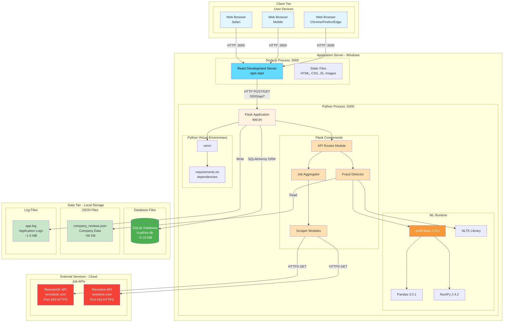

# Deployment Diagram - TrustHire Job Fraud Detection System



## Deployment Architecture

### Physical Nodes

#### **1. User Devices (Client Tier)**
- **Hardware**: Desktop PC, Laptop, Mobile Device
- **OS**: Windows 10/11, macOS, Linux, iOS, Android
- **Software**: 
  - Web Browser (Chrome 90+, Firefox 88+, Safari 14+, Edge 90+)
  - JavaScript enabled
- **Network**: Internet connection (HTTP/HTTPS)

#### **2. Application Server (Windows)**
- **Hardware Specifications**:
  - CPU: 4+ cores (Intel i5/i7 or AMD equivalent)
  - RAM: 8 GB minimum, 16 GB recommended
  - Storage: 20 GB available space (SSD preferred)
  - Network: Ethernet/WiFi with stable connection

- **Operating System**:
  - **OS**: Windows 10/11 (64-bit)
  - **Version**: Build 19041 or later
  - **User**: Administrator or user with Python install privileges

- **Runtime Environment**:
  1. **Node.js Runtime**
     - Version: 16.x or 18.x LTS
     - Package Manager: npm 8.x
     - Global packages: create-react-app
     - Port: 3000

  2. **Python Runtime**
     - Version: Python 3.13.0 (64-bit)
     - Location: `c:\Users\chand\Documents\GitHub\TrustHire\backend\venv\`
     - Package Manager: pip 24.x
     - Virtual Environment: Activated
     - Port: 5000

#### **3. Storage (Data Tier)**
- **Location**: Local file system
- **Path**: `c:\Users\chand\Documents\GitHub\TrustHire\`
- **Components**:
  - SQLite database file
  - JSON configuration files
  - Application logs
  - Company reviews data

#### **4. External Services (Cloud)**
- **Hosting**: Third-party cloud providers
- **Access**: HTTPS (Port 443)
- **Availability**: 99.9% uptime
- **Rate Limits**: Varies by provider

## Network Topology

### Development Environment

```
User's PC (Windows)
  │
  ├─ localhost:3000 (React Dev Server)
  │    │
  │    └─ Serves: Frontend assets
  │         • HTML, CSS, JavaScript
  │         • Images, Fonts
  │         • Source maps
  │
  └─ localhost:5000 (Flask API Server)
       │
       ├─ Serves: REST API endpoints
       │    • /api/search
       │    • /api/report
       │    • /api/history
       │
       └─ Connects to:
            • SQLite (local file)
            • company_reviews.json (local file)
            • External APIs (internet)
```

### Network Protocols

1. **Client ↔ Frontend**
   - **Protocol**: HTTP/1.1
   - **Port**: 3000
   - **Method**: GET
   - **Content-Type**: text/html, application/javascript, text/css

2. **Frontend ↔ Backend**
   - **Protocol**: HTTP/1.1
   - **Port**: 5000
   - **Methods**: POST, GET
   - **Content-Type**: application/json
   - **CORS**: Enabled (Allow-Origin: http://localhost:3000)

3. **Backend ↔ External APIs**
   - **Protocol**: HTTPS/1.1
   - **Port**: 443
   - **Method**: GET
   - **Authentication**: None (public APIs)
   - **Timeout**: 5 seconds

4. **Backend ↔ Database**
   - **Protocol**: SQLite native (file-based)
   - **Connection**: Direct file I/O
   - **Transactions**: ACID compliant

## Software Deployment

### Frontend Deployment (Development)

```
c:\Users\chand\Documents\GitHub\TrustHire\frontend\
│
├── node_modules/          (22,000+ packages, ~350 MB)
│   ├── react@18.x
│   ├── react-dom@18.x
│   ├── axios@1.x
│   └── ...
│
├── public/
│   ├── index.html         (Entry point)
│   └── favicon.ico
│
├── src/
│   ├── index.js           (Root)
│   ├── App.js             (Main component)
│   ├── components/        (UI components)
│   │   ├── SearchBar.js
│   │   ├── JobCard.js
│   │   ├── JobList.js
│   │   └── Statistics.js
│   ├── services/
│   │   └── api.js         (HTTP client)
│   └── *.css              (Stylesheets)
│
├── package.json           (Dependencies manifest)
└── package-lock.json      (Dependency tree)

Deployment Command:
> npm start

Output:
- Development server on http://localhost:3000
- Hot module replacement enabled
- Auto-reloads on file changes
```

### Backend Deployment

```
c:\Users\chand\Documents\GitHub\TrustHire\backend\
│
├── venv/                  (Python virtual environment, ~500 MB)
│   ├── Scripts/
│   │   ├── python.exe     (Python 3.13.0)
│   │   ├── pip.exe
│   │   └── activate.ps1   (Activation script)
│   └── Lib/
│       └── site-packages/ (Installed packages)
│
├── app.py                 (Flask entry point)
├── config.py              (Configuration)
├── database.py            (Database models)
│
├── api/
│   └── routes.py          (API endpoints)
│
├── models/
│   ├── fraud_detector.py  (ML fraud detection)
│   └── job_model.py       (Job aggregator)
│
├── scrapers/
│   ├── base_scraper.py
│   ├── remoteok_scraper.py
│   └── remotive_scraper.py
│
├── utils/
│   ├── validators.py
│   └── text_processor.py
│
├── data/
│   └── company_reviews.json (50 KB)
│
├── instance/
│   └── trusthire.db       (SQLite database, ~5-10 MB)
│
├── requirements.txt       (Python dependencies)
└── app.log               (Rotating logs)

Deployment Commands:
> cd backend
> .\venv\Scripts\Activate.ps1
> python app.py

Output:
- Flask server on http://localhost:5000
- Debugger enabled
- Auto-reloads on file changes
- ML model trained on startup (~2 seconds)
```

### Database Deployment

**SQLite Database (`trusthire.db`)**

Location: `backend/instance/trusthire.db`

Schema:
```sql
-- Job table
CREATE TABLE job (
    id INTEGER PRIMARY KEY AUTOINCREMENT,
    title VARCHAR(200) NOT NULL,
    company VARCHAR(200),
    description TEXT,
    location VARCHAR(200),
    salary VARCHAR(100),
    url VARCHAR(500),
    platform VARCHAR(50),
    trust_score FLOAT,
    is_fraudulent BOOLEAN,
    posted_date DATETIME,
    scraped_at DATETIME DEFAULT CURRENT_TIMESTAMP
);

-- UserReport table
CREATE TABLE user_report (
    id INTEGER PRIMARY KEY AUTOINCREMENT,
    job_id INTEGER,
    report_type VARCHAR(50),
    reason TEXT,
    user_email VARCHAR(200),
    created_at DATETIME DEFAULT CURRENT_TIMESTAMP,
    FOREIGN KEY (job_id) REFERENCES job(id)
);

-- SearchHistory table
CREATE TABLE search_history (
    id INTEGER PRIMARY KEY AUTOINCREMENT,
    query VARCHAR(200),
    location VARCHAR(200),
    experience VARCHAR(100),
    results_count INTEGER,
    searched_at DATETIME DEFAULT CURRENT_TIMESTAMP
);
```

## Resource Requirements

### Memory (RAM)
- **Node.js Process**: ~200-400 MB
- **Flask Process**: ~150-300 MB
- **Python ML Libraries**: ~200-400 MB (loaded on demand)
- **Total Minimum**: 1 GB
- **Recommended**: 2-4 GB available

### CPU
- **Idle**: ~5% usage
- **During Search**: 20-40% usage (parallel scraping)
- **ML Prediction**: 10-30% per job (100ms duration)
- **Cores**: 2+ cores recommended

### Storage
- **Frontend node_modules**: ~350 MB
- **Backend venv**: ~500 MB
- **Database**: 5-10 MB (grows over time)
- **Logs**: 1-5 MB (rotating)
- **Source Code**: ~10 MB
- **Total**: ~870 MB minimum

### Network Bandwidth
- **Frontend Assets**: ~2-5 MB initial load
- **API Requests**: ~5-50 KB per search
- **External APIs**: ~10-100 KB per scraper call
- **Minimum**: 1 Mbps
- **Recommended**: 10+ Mbps

## Production Deployment (Future)

### Recommended Architecture

```
Internet
  │
  ├─ Load Balancer (nginx)
  │    │
  │    ├─ Application Server 1
  │    │    ├─ Frontend (React Build)
  │    │    └─ Backend (Gunicorn + Flask)
  │    │
  │    └─ Application Server 2
  │         ├─ Frontend (React Build)
  │         └─ Backend (Gunicorn + Flask)
  │
  └─ Database Server
       └─ PostgreSQL (instead of SQLite)
```

### Production Components

1. **Web Server**: nginx (reverse proxy, static files)
2. **WSGI Server**: Gunicorn (4+ workers)
3. **Database**: PostgreSQL or MySQL
4. **Caching**: Redis (API response caching)
5. **Process Manager**: systemd or PM2
6. **Monitoring**: Prometheus + Grafana
7. **Logging**: ELK Stack or CloudWatch

### Security Considerations

- **HTTPS**: SSL/TLS certificates (Let's Encrypt)
- **Authentication**: JWT tokens for API
- **Rate Limiting**: Per-IP request limits
- **Input Validation**: Strict sanitization
- **CORS**: Restricted origins
- **Database**: Connection pooling, prepared statements
- **Secrets**: Environment variables, not in code

## Startup Sequence

1. **User starts frontend**: `npm start`
   - React dev server starts on port 3000
   - Webpack compiles assets
   - Browser opens automatically

2. **User starts backend**: `python app.py`
   - Flask initializes
   - Database tables created (if not exist)
   - ML model loads and trains (~2 sec)
   - Company reviews loaded
   - Server ready on port 5000

3. **User accesses application**: `http://localhost:3000`
   - Browser loads React app
   - API calls to `http://localhost:5000`
   - Jobs scraped and analyzed
   - Results displayed

## Maintenance & Operations

- **Logs**: Check `backend/app.log` for errors
- **Updates**: `pip install -r requirements.txt` for backend
- **Database**: Backup `trusthire.db` regularly
- **Performance**: Monitor CPU/RAM usage
- **Cleanup**: Clear old logs, vacuum database
